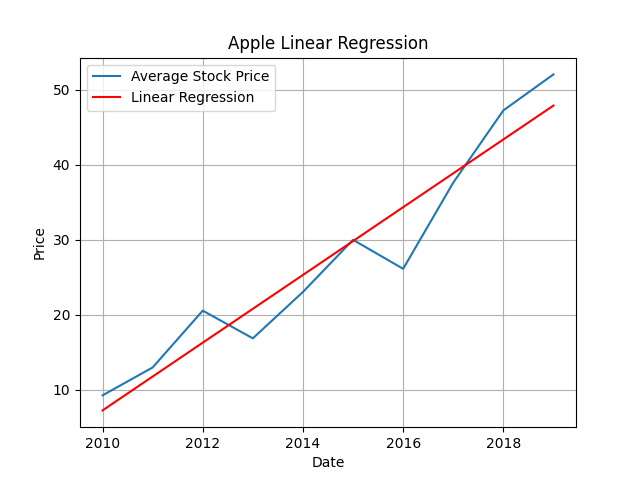

# Python-Pandas-Numpy-Sklearn

Spring 2020
Older project which used Pandas, matplotlib, numpy, and scikit-learn

This was a project for a Introduction to Scientific Computing. This class explored various libraries within Python such as Pandas and Numpy. A typical assignments consisted of root-finding algorithms, quadrature, least squares, linear systems, and first order differential equations.

The programs goal was to solve another classes final project, using the skills we learned in this class. In this case, plotting Linear Regression for multiple stocks.

  
    
    
    
    
    
  

